<!-- section start -->
<!-- attr: { class:'slide-title', showInPresentation:true, hasScriptWrapper:true, style:'' } -->
# Graphs Algorithms
##  Traversal Algorithms, Dijkstra’s Algorithm, Topological Sorting, Prim and Kruskal
<div class="signature">
    <p class="signature-course">Data Structures and Algorithms</p>
    <p class="signature-initiative">Telerik Software Academy</p>
    <a href = "http://academy.telerik.com " class="signature-link">http://academy.telerik.com </a>
</div>


<!-- section start -->
<!-- attr: { showInPresentation:true, hasScriptWrapper:true, style:'' } -->
# Table of Contents
* Graph Traversal Algorithms
* Connectivity
* Dijkstra’s Algorithm
* Topological sorting
* Prim and Kruskal


<!-- section start -->
<!-- attr: { class:'slide-section', showInPresentation:true, style:'' } -->
<!-- # Traversing Graphs
##  Good old DFS and BFS -->

<!-- attr: { showInPresentation:true, hasScriptWrapper:true, style:'' } -->
# Graph Traversal Algorithms
* **Depth-First Search** (DFS) and **Breadth-First Search** (BFS) can traverse graphs
  * Each vertex should be visited at most once

<pre class="lang-cs hljs " style="width:40%; float:left">
BFS(node)
{
  queue &larr; node
  visited[node] = true
  while queue not empty
    v &larr; queue
    print v
    for each child c of v
      if not visited[c]
        queue &larr; c
        visited[c] = true
}
</pre>

<pre class="lang-cs hljs " style="width:40%; float:right">
DFS(node)
{
  stack &larr; node
  visited[node] = true
  while stack not empty
    v &larr; stack
    print v
    for each child c of v
      if not visited[c]
        stack &larr; c
        visited[c] = true
}
</pre>

<!-- attr: { showInPresentation:true, hasScriptWrapper:true, style:'' } -->
# Recursive DFS Graph Traversal

```cs
void TraverseDFSRecursive(node)
{
  if (not visited[node])
  {
    visited[node] = true;
    print node;
    foreach child node c of node
    {
       TraverseDFSRecursive(c);
    }
  }
}

void Main()
{
  TraverseDFS(firstNode);
}
```

<!-- attr: { class:'slide-section demo', showInPresentation:true, style:'' } -->
<!-- # Graphs and Traversals -->
##  [Demo]()


<!-- section start -->
<!-- attr: { class:'slide-section', showInPresentation:true, hasScriptWrapper:true, style:'' } -->
<!-- # Connectivity
##  Connecting the chain -->

<!-- attr: { showInPresentation:true, hasScriptWrapper:true, style:'' } -->
# Connectivity
* **Connected component** of undirected graph
  *  A sub-graph in which any two nodes are connected to each other by paths

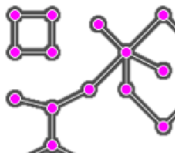

<!-- attr: { showInPresentation:true, hasScriptWrapper:true, style:'' } -->
<!-- # Connectivity -->
* A simple way to find number of connected components
  * A loop through all nodes and start a **DFS** or **BFS** traversing from any unvisited node
* Each time you start a new traversing
  * You find a new connected component!

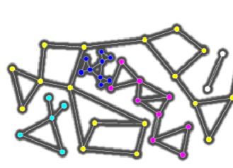

<!-- attr: { showInPresentation:true, hasScriptWrapper:true, style:'font-size:0.9em' } -->
<!-- # Connectivity -->
* Algorithm:
```cs
foreach node from graph G
{
   if node is unvisited
   {
      DFS(node);
      countOfComponents++;
   }
}
```
  * _Note_: Do not forget to mark each node in the DFS as visited!
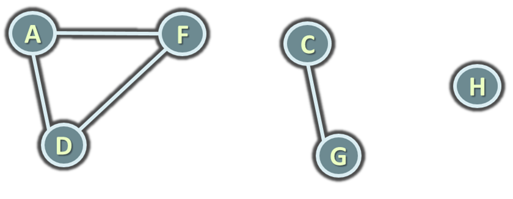

<!-- attr: { showInPresentation:true, hasScriptWrapper:true, style:'' } -->
<!-- # Connectivity -->
<div style="width:75%">
* **Connected graph**
  * A graph with only **one** connected component
* In every connected graph a path exists between any two nodes
* Checking whether a graph is connected
  * If DFS / BFS passes through all vertices &rarr; graph is connected!
</div>
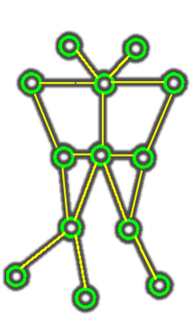

<!-- attr: { class:'slide-section demo', showInPresentation:true, style:'' } -->
<!-- # Connectivity -->
##  [Demo]()


<!-- section start -->
<!-- attr: { class:'slide-section', showInPresentation:true, hasScriptWrapper:true, style:'' } -->
<!-- # Dijkstra’s Algorithm
##  Shortest path in graph -->

<!-- attr: { showInPresentation:true, style:'' } -->
# Dijkstra’s Algorithm

* Find the **shortest path** from vertex `A` to all other vertices
  * The path is a directed path between them such that no other path has a lower weight.
* **Assumptions**
  * Edges can be directed or not
  * Weight does not have to be distance
  * Weights are positive or zero
  * Shortest path is not necessary unique
  * Not all edges need to be reachable

<!-- attr: { showInPresentation:true, hasScriptWrapper:true, style:'font-size:0.95em' } -->
<!-- # Dijkstra’s Algorithm -->
* In non-weighted graphs or edges with same weight finding shortest path can be done with BFS
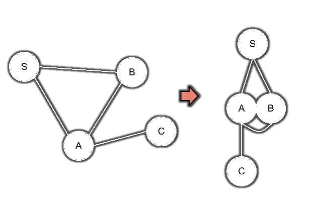
  * _Note_: Path from A to B does not matter – triangle inequality


<!-- attr: { showInPresentation:true, hasScriptWrapper:true, style:'' } -->
<!-- # Dijkstra’s Algorithm -->
* In weighted graphs – simple solution can be done with breaking the edges in sub-vertexes
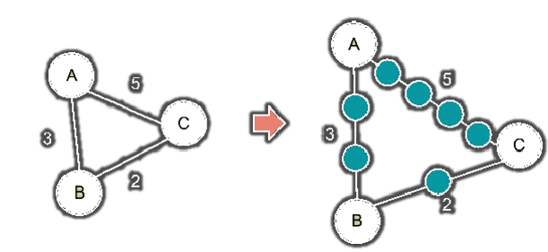
  * _Note_:Too much memory usage even for smaller graphs!

<!-- attr: { showInPresentation:true, hasScriptWrapper:true, style:'' } -->
<!-- # Dijkstra’s Algorithm -->
* Solution to this problem:
  * `Priority queue` instead of `queue`
  * **Keeping information** about the shortest distance so far
* Steps:
  * Enqueue all distances from S
  * Get the lowest in priority - B
  * If edge `(B, A)` exists, check `(S, B) + (B, A)` and save the lower one
  * Overcome the triangle inequality miss

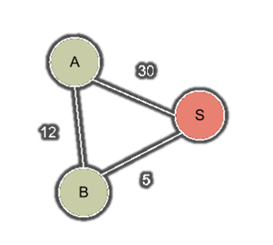

<!-- attr: { showInPresentation:true, hasScriptWrapper:true, style:'' } -->
<!-- # Dijkstra’s Algorithm -->
* **Dijkstra’s algorithm:**
<ol>
    <li>Set the distance to every node to Infinity except the source node – must be zero</li>
    <li>Mark every node as unprocessed</li>
    <li>Choose the first unprocessed node with smallest non-infinity distance as current. If such does not exist, the algorithm has finished</li>
    <li>At first we set the current node our **Source**</li>
</ol>

<!-- attr: { showInPresentation:true, hasScriptWrapper:true, style:'' } -->
<!-- # Dijkstra’s Algorithm -->
<ol start="5">
    <li>Calculate the distance for all unprocessed neighbors by adding the current distance to the already calculated one</li>
    <li>If the new distance is smaller than the previous one – set the new value</li>
    <li>Mark the current node as processed</li>
    <li>Repeat step **3.**</li>
</ol>

<!-- attr: { showInPresentation:true, hasScriptWrapper:true, style:'' } -->
<!-- # Dijkstra’s Algorithm -->
* Example graph:

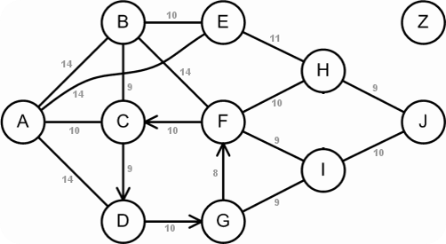

<!-- attr: { showInPresentation:true, style:'font-size:0.95em' } -->
<!-- # Dijkstra’s Algorithm -->
* Pseudo code

```
set all nodes DIST = INFINITY;
set current node the source and distance = 0;
Q -> all nodes from graph, ordered by distance;
while (Q is not empty)
    a = dequeue the smallest element (first in PriorityQueue);
    if (distance of a == INFINITY) break

    foreach neighbour v of a     
        potDistance = distance of a + distance of (a-v)      
        if (potDistance < distance of v)
            distance of v = potDistance;
            reorder Q;
```

<!-- attr: { showInPresentation:true, style:'' } -->
<!-- # Dijkstra’s Algorithm -->
* Modifications
  * Saving the route
  * Having a target node
  * Array implementation, Queue, Priority Queue
  * A*
* Complexity
  * `O((|V| + |E|).log(|V|))`
* Applications –GPS, Networks, Air travels, etc.

<!-- attr: { class:'slide-section demo', showInPresentation:true, style:'' } -->
<!-- # Dijkstra’s Algorithm -->
##  [Demo]()


<!-- section start -->
<!-- attr: { class:'slide-section', showInPresentation:true, hasScriptWrapper:true, style:'' } -->
<!-- # Topological Sorting
##  Order it! -->

<!-- attr: { showInPresentation:true, hasScriptWrapper:true, style:'' } -->
# Topological Sorting
* Topological ordering of a **directed graph**
  * Linear ordering of its vertices
  * For every directed edge `(U, V)`, `U` comes before `V` in the ordering
* _Example_:
  * 7, 5, 3, 11, 8, 2, 9, 10
  * 3, 5, 7, 8, 11, 2, 9, 10
  * 5, 7, 3, 8, 11, 10, 9, 2

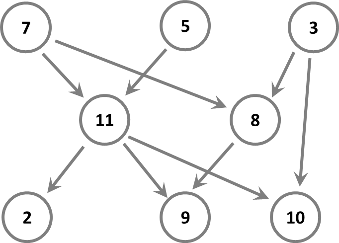

<!-- attr: { showInPresentation:true, hasScriptWrapper:true, style:'' } -->
<!-- # Topological Sorting -->
* **Rules**
  * Undirected graph cannot be sorted
  * Directed graphs with cycles cannot be sorted
  * Sorting is not unique
  * Various sorting algorithms exists and they give different results

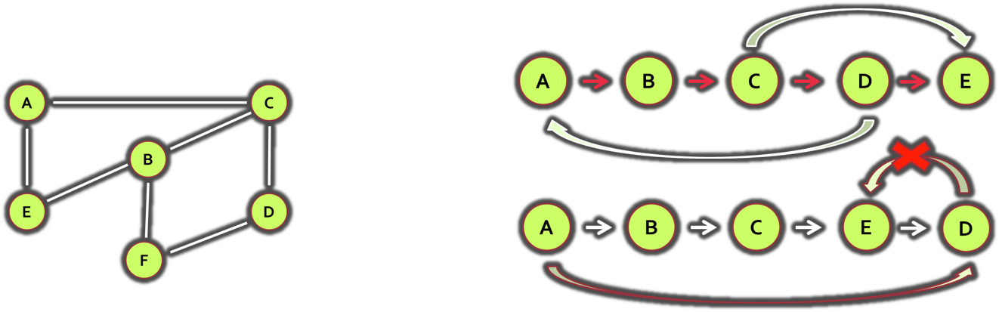

<!-- attr: { showInPresentation:true, style:'' } -->
<!-- # Topological Sorting -->
* **Source removal algorithm**
  1. Create an Empty List
  2. Find a Node without incoming Edges
  3. Add this Node to the end of the List
  4. Remove the Edge from the Graph
  5. Repeat until the Graph is empty

<!-- attr: { showInPresentation:true, style:'' } -->
<!-- # Topological Sorting -->
* Pseudo code

```
L ← Empty list that will contain the sorted elements
S ← Set of all nodes with no incoming edges
while S is non-empty do
    remove a node n from S
    insert n into L
    for each node m with an edge e from n to m do
        remove edge e from the graph
        if m has no other incoming edges then
            insert m into S
if graph has edges then
    return error (graph has at least one cycle)
else
    return L (a topologically sorted order)
```

<!-- attr: { showInPresentation:true, hasScriptWrapper:true, style:'', 'data-transition':'none'  } -->
# Step #1-2

* The node `A` is the only node without incoming edges <!--  -->

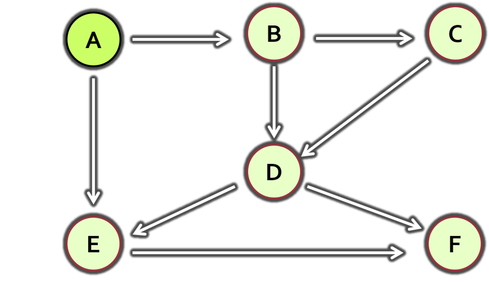


<!-- attr: { showInPresentation:true, hasScriptWrapper:true, style:'', 'data-transition':'none' } -->
# Step #3-4

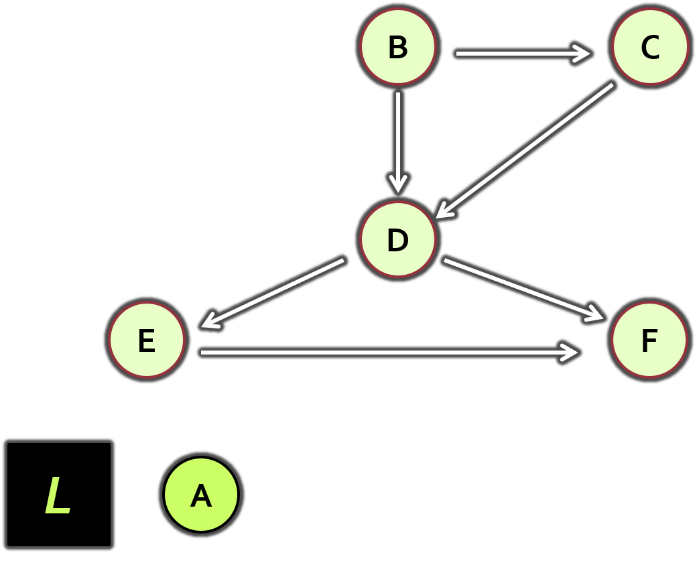

<!-- attr: { showInPresentation:true, hasScriptWrapper:true, style:'', 'data-transition':'none'  } -->
# Step #2
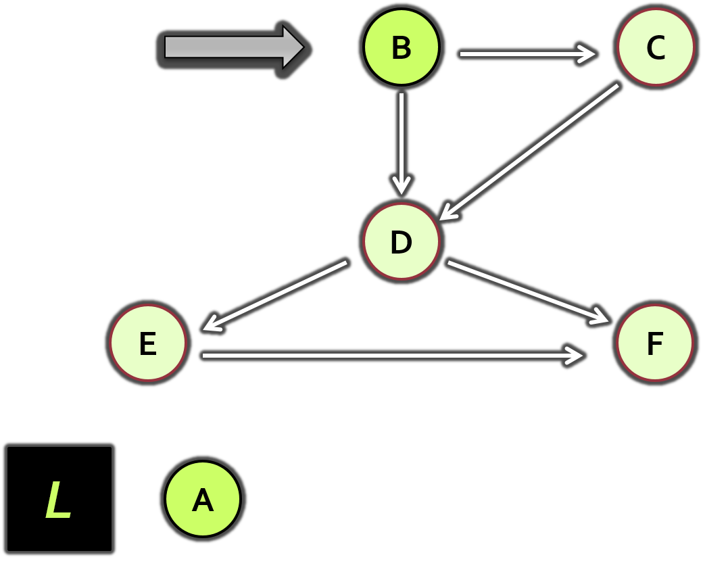

<!-- attr: { showInPresentation:true, hasScriptWrapper:true, style:'', 'data-transition':'none'  } -->
# Step #3-4
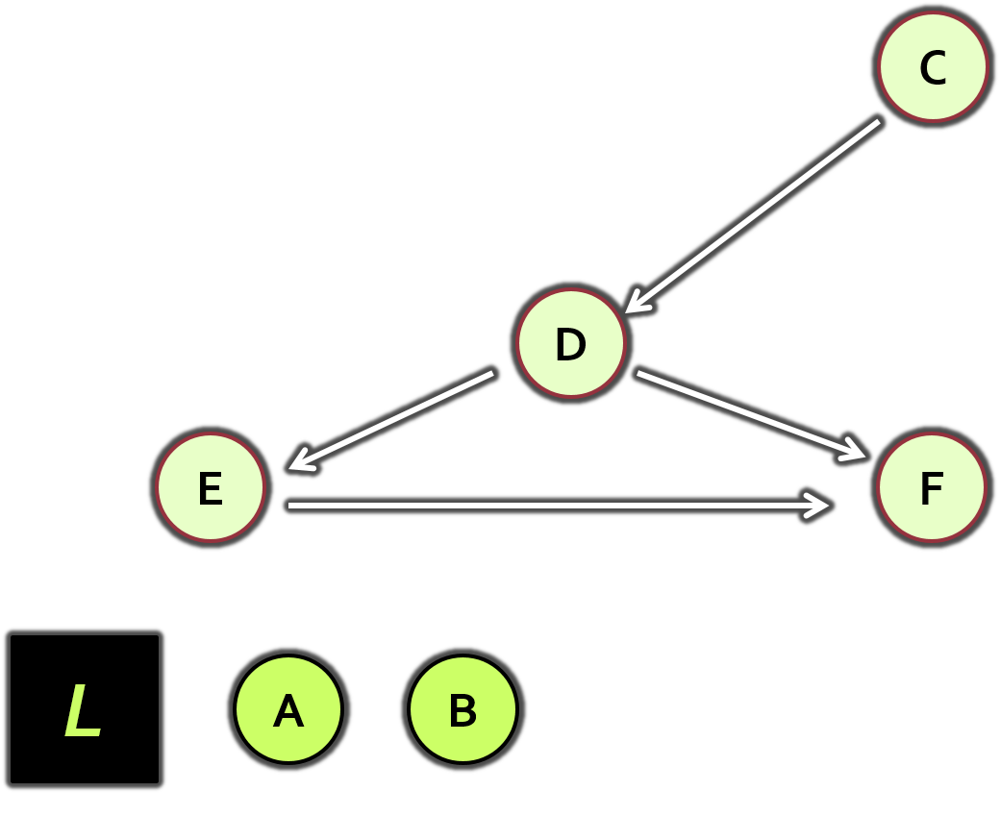

<!-- attr: { showInPresentation:true, hasScriptWrapper:true, style:'', 'data-transition':'none'  } -->
# Step #2


<!-- attr: { showInPresentation:true, hasScriptWrapper:true, style:'', 'data-transition':'none'  } -->
# Step #3-4
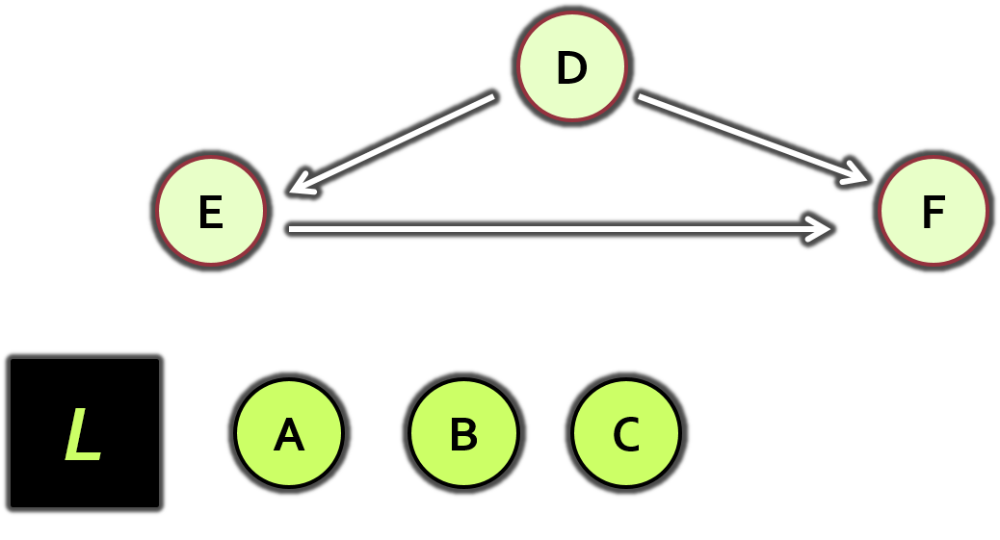

<!-- attr: { showInPresentation:true, hasScriptWrapper:true, style:'', 'data-transition':'none'  } -->
# Step #2


<!-- attr: { showInPresentation:true, hasScriptWrapper:true, style:'', 'data-transition':'none'  } -->
# Step #3-4
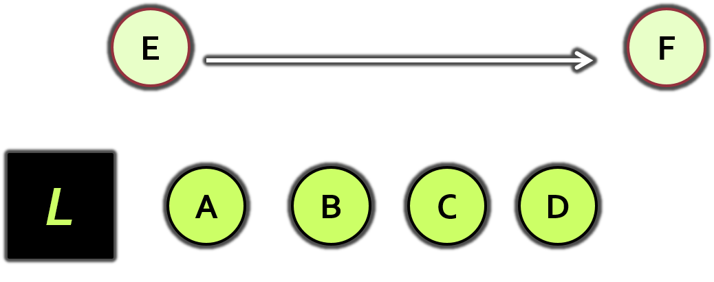

<!-- attr: { showInPresentation:true, hasScriptWrapper:true, style:'', 'data-transition':'none'  } -->
# Step #2
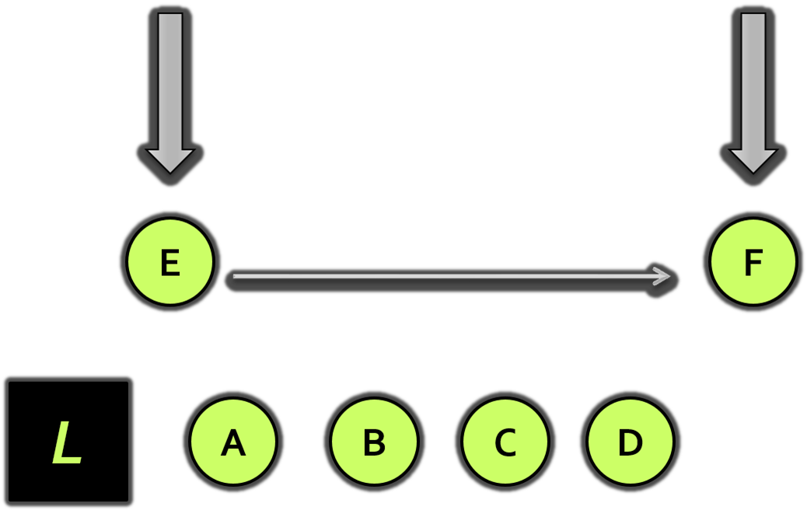

<!-- attr: { showInPresentation:true, hasScriptWrapper:true, style:'', 'data-transition':'none'  } -->
# Result:TS
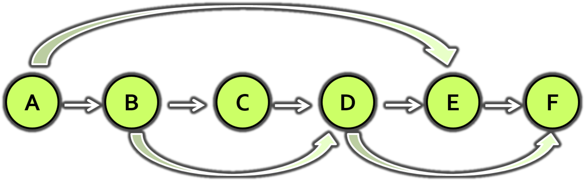

<!-- attr: { showInPresentation:true, style:'' } -->
<!-- # Topological Sorting -->
* **DFS algorithm**
  * Create an empty List
  * Find a Node without Outgoing Edges
  * Mark the Node as visited
  * Add the node to the List
  * Stop when reach visited node
  * Reverse the List and get the TS of the Elements

<!-- attr: { showInPresentation:true, style:'' } -->
<!-- # Topological Sorting -->
* Pseudo code

```
L ← Empty list that will contain the sorted nodes
while there are unmarked nodes do
    select an unmarked node n
    visit(n)
function visit(node n)
    if n has a temporary mark then stop (not a DAG)
    if n is not marked (i.e. has not been visited yet) then
        mark n temporarily
        for each node m with an edge from n to m do
            visit(m)
        mark n permanently
        add n to head of L
```
[topological-sorting](http://www.geeksforgeeks.org/topological-sorting/)

<!-- attr: { class:'slide-section demo', showInPresentation:true, style:'' } -->
<!-- # TS Using DFS -->
##  [Demo]()


<!-- section start -->
<!-- attr: { class:'slide-section', showInPresentation:true, hasScriptWrapper:true, style:'' } -->
<!-- # Minimum Spanning Tree -->

<!-- attr: { showInPresentation:true, hasScriptWrapper:true, style:'' } -->
# Minimum Spanning Tree
* Spanning Tree
  * Subgraph (Tree)
  * Connects all vertices together
* All connected graphs have spanning tree

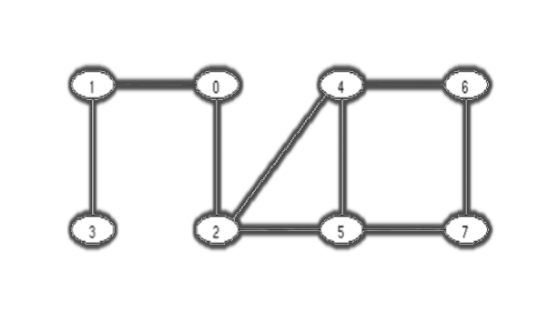

<!-- attr: { showInPresentation:true, hasScriptWrapper:true, style:'' } -->
# Minimum Spanning Tree
* Minimum Spanning Tree
  * weight <= weight(all other spanning trees)
* First used in electrical network
  * Minimal cost of wiring


<!-- attr: { class:'slide-section', showInPresentation:true, hasScriptWrapper:true, style:'margin-top:-10%' } -->
# Minimum Spanning Forest
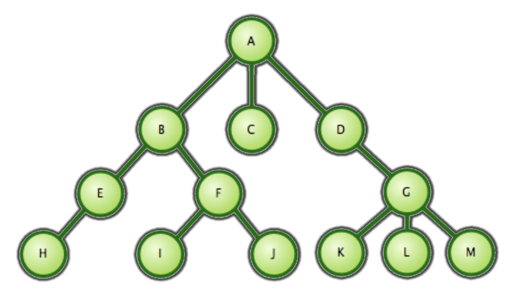

<!-- attr: { showInPresentation:true, hasScriptWrapper:true, style:'' } -->
# Minimum Spanning Forest
* Minimum Spanning Forest – set of all minimum spanning trees (when the graph is not connected)

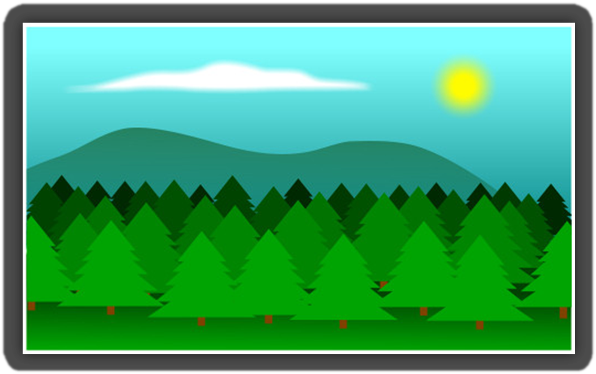

<!-- section start -->
<!-- attr: { class:'slide-section', showInPresentation:true, hasScriptWrapper:true, style:'margin-top:-10%' } -->
# Prim’s Algorithm
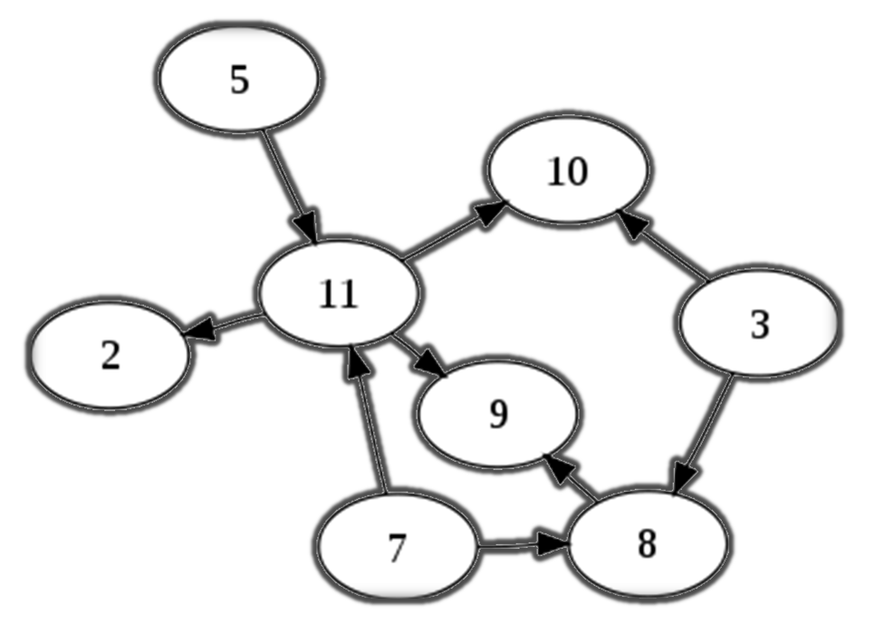

<!-- attr: { showInPresentation:true, style:'' } -->
# Prim’s Algorithm
* Create a tree T containing a single vertex (chosen randomly)
* Create a set S from all the edges in the graph
* Loop until every edge in the set connects two vertices in the tree
  * Remove from the set an edge with minimum weight that connects a vertex in the tree with a vertex not in the tree
  * Add that edge to the tree
* _Note_: the graph must be connected

<!-- attr: { showInPresentation:true, hasScriptWrapper:true, style:'' } -->
<!-- # Prim’s Algorithm -->
* _Note_: at every step before adding an edge to the tree we check if it makes a cycle in the tree or if it is already in the queue
* When we add a vertex we check if it is the last which is not visited

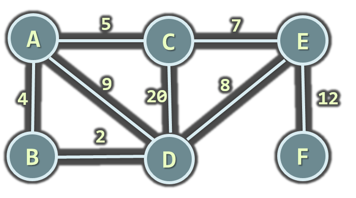


<!-- attr: { showInPresentation:true, hasScriptWrapper:true, style:'' } -->
<!-- # Prim’s Algorithm -->
* We build a tree with the single vertex A
* Priority queue which contains all edges that connect A with the other nodes (AB, AC, AD)

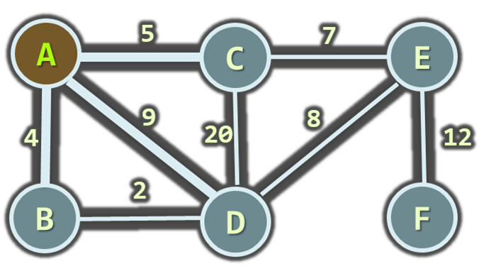


<!-- attr: { showInPresentation:true, hasScriptWrapper:true, style:'' } -->
<!-- # Prim’s Algorithm -->
* The tree still contains the only vertex A
* We dequeue the first edge from the priority queue (4) and we add the edge and the other vertex (B) form that edge to the tree
* We push all edges that connect B with other nodes in the queue
  * Note that the edges 5 and 9 are still in the queue <!-- .element: style="width:40%" -->

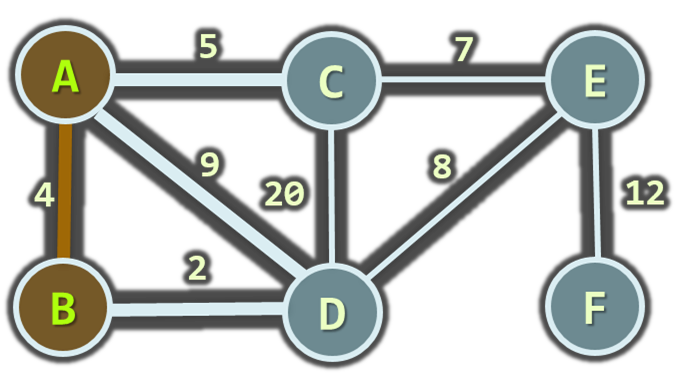


<!-- attr: { showInPresentation:true, hasScriptWrapper:true, style:'' } -->
<!-- # Prim’s Algorithm -->
* Now the tree contains vertices A and B and the edge between them
* We dequeue the first edge from the priority queue (2) and we add the edge and the other vertex (D) from that edge to the tree
* We push all edges that connect D with other nodes in the queue <!-- .element: style="width:45%" -->

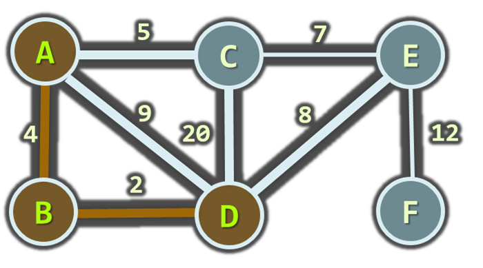


<!-- attr: { showInPresentation:true, hasScriptWrapper:true, style:'' } -->
# Prim’s Algorithm
* Now the tree contains vertices A, B and D and the edges (4, 2) between them
* We dequeue the first edge from the priority queue (5) and we add the edge and the other vertex (C) from that edge to the tree
* We push all edges that connect C with other nodes in the queue <!-- .element: style="width:45%" -->

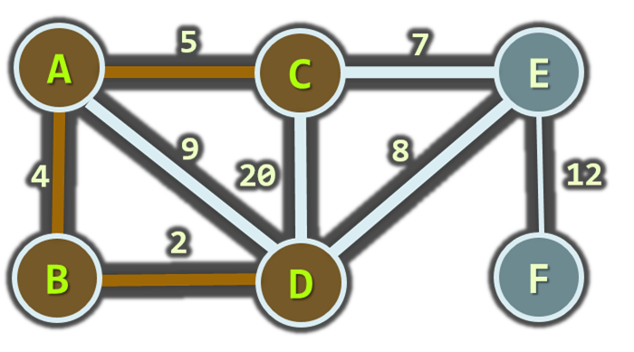

<!-- attr: { showInPresentation:true, hasScriptWrapper:true, style:'' } -->
# Prim’s Algorithm
* Now the tree contains vertices A, B, D and C and the edges (4, 2, 5) between them
* We dequeue the first edge from the priority queue (7) and we add the edge and the other vertex (E) from that edge to the tree
* We push all edges that connect C with other nodes in the queue <!-- .element: style="width:45%" -->


<!-- attr: { showInPresentation:true, hasScriptWrapper:true, style:'' } -->
# Prim’s Algorithm
* Now the tree contains vertices A, B, D, C and E and the edges (4, 2, 5, 7) between them
* We dequeue the first edge from the priority queue (8)

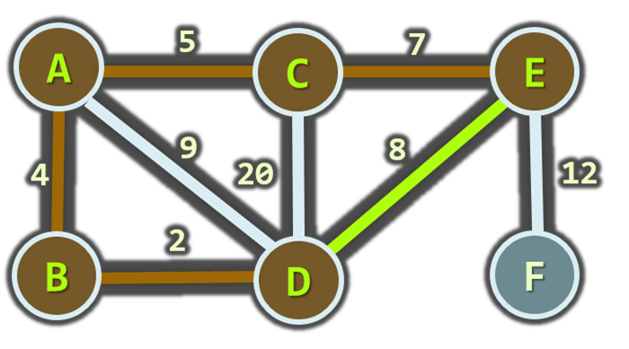


<!-- attr: { showInPresentation:true, hasScriptWrapper:true, style:'' } -->
# Prim’s Algorithm
* This edge will cost a cycle
* So we get the next one – 9
  * This edge will also cost a cycle
* So we get the next one – 12
  * We add it to the tree
  * We add the vertex F to the tree <!-- .element: style="width:65%" -->

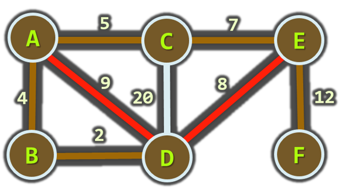


<!-- attr: { class:'slide-section demo', showInPresentation:true, style:'' } -->
<!-- # Prim -->
##  [Demo]()


<!-- section start -->
<!-- attr: { class:'slide-section', showInPresentation:true, hasScriptWrapper:true, style:'' } -->
# Kruskal’s Algorithm

<!-- attr: { showInPresentation:true, hasScriptWrapper:true, style:'' } -->
# Kruskal’s Algorithm
* The graph may not be connected
  * If the graph is not connected – minimum spanning forest

<!-- attr: { showInPresentation:true, style:'' } -->
# Kruskal’s Algorithm
* Create forest F (each tree is a vertex)
* Set S – all edges in the graph
* While S is not empty and F is not spanning
  * Remove edge with min cost from S
  * If that edge connects two different trees – add it to the forest (these two trees are now a single tree)
  * Else discard the edge
* The graph may not be connected

<!-- attr: { showInPresentation:true, hasScriptWrapper:true, style:'' } -->
# Kruskal’s Algorithm
* We build a forest containing all vertices from the graph
* We sort all edges
* Edges are – 2, 4, 5, 7, 8, 9, 12, 20


<!-- attr: { showInPresentation:true, hasScriptWrapper:true, style:'' } -->
<!-- # Kruskal’s Algorithm -->
* At every step we select the edge with the smallest weight and remove it from the list with edges
* If it connects two different trees from the forest we add it and connect these trees


<!-- attr: { showInPresentation:true, hasScriptWrapper:true, style:'' } -->
<!-- # Kruskal’s Algorithm -->
* We select the edge 2
* This edge connects the vertices B and D (they are in different trees)
* We add it

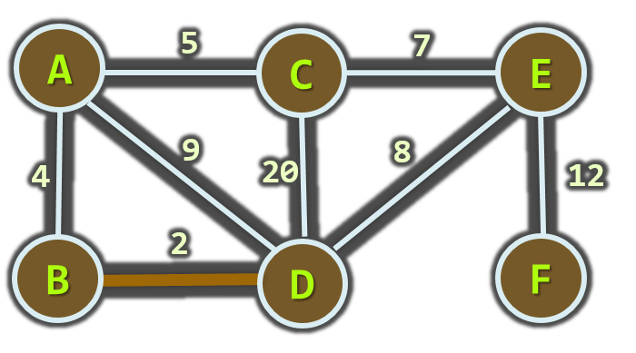

<!-- attr: { showInPresentation:true, hasScriptWrapper:true, style:'' } -->
<!-- # Kruskal’s Algorithm -->
* We select the edge 4
* This edge connects the vertices A and B (they are different trees)
* We add it

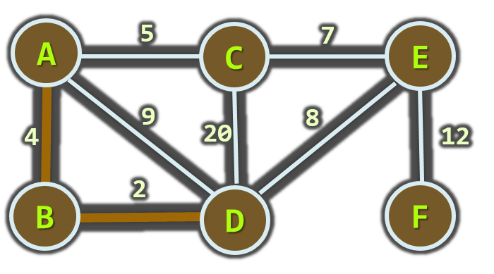

<!-- attr: { showInPresentation:true, hasScriptWrapper:true, style:'' } -->
<!-- # Kruskal’s Algorithm -->
* We select the edge 5
* This edge connects the vertices A and C (they are different trees)
* We add it

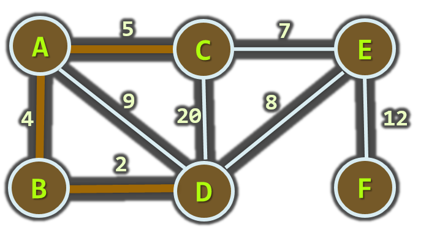

<!-- attr: { showInPresentation:true, hasScriptWrapper:true, style:'' } -->
<!-- # Kruskal’s Algorithm -->
* We select the edge 7
* This edge connects the vertices C and E (they are different trees)
* We add it

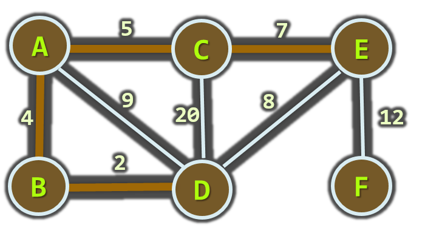

<!-- attr: { showInPresentation:true, hasScriptWrapper:true, style:'' } -->
<!-- # Kruskal’s Algorithm -->
* We select the edge 8
* This edge connects the vertices E and D (they are not different trees)
* We don’t add it


<!-- attr: { showInPresentation:true, hasScriptWrapper:true, style:'' } -->
<!-- # Kruskal’s Algorithm -->
* We select the edge 9
* This edge connects the vertices A and D (they are not different trees)
* We don’t add it

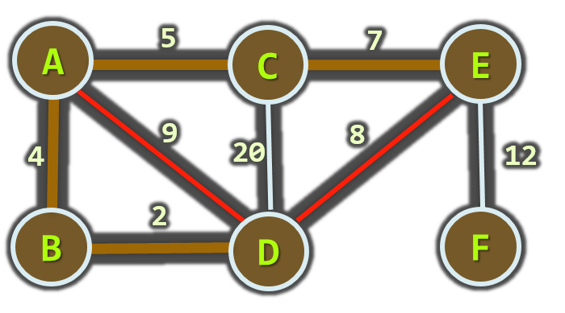

<!-- attr: { showInPresentation:true, hasScriptWrapper:true, style:'' } -->
<!-- # Kruskal’s Algorithm -->
* We select the edge 12
* This edge connects the vertices E and F (they are not different trees)
* We add it

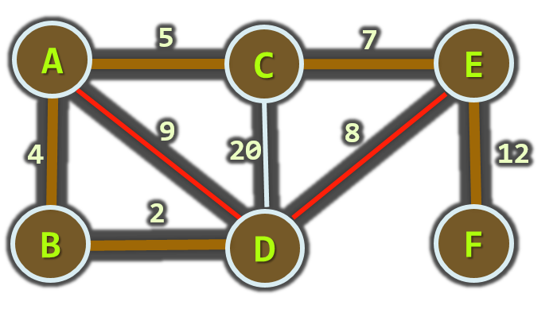

<!-- attr: { showInPresentation:true, hasScriptWrapper:true, style:'' } -->
<!-- # Kruskal’s Algorithm -->
* We can have a function that checks at every step if all vertices are connected and the tree that we build is spanning
* If we have such function we stop
* Otherwise we check for the other edges
  * We just won’t add them to the tree


<!-- attr: { class:'slide-section demo', showInPresentation:true, hasScriptWrapper:true, style:'' } -->
<!-- # Kruskal’s Algorithm -->
##  [Demo]()


<!-- section start -->
<!-- attr: { id:'questions', class:'slide-section', showInPresentation:true, style:'' } -->
# Questions
## Trees and Graphs
[link to Telerik Academy Forum](http://telerikacademy.com/Forum/Category/15/data-structures-algorithms)
