<!-- section start -->

<!-- attr: { class:'slide-title', showInPresentation:true, hasScriptWrapper:true, style:'' } -->
# Graphs
##  Fundamentals, Terminology

<div class="signature">
    <p class="signature-course">Data Structures and Algorithms</p>
    <p class="signature-initiative">Telerik Software Academy</p>
    <a href="http://academy.telerik.com " class="signature-link">http://academy.telerik.com </a>
</div>

<!-- section start -->

<!-- attr: { showInPresentation:true, hasScriptWrapper:true, style:'' } -->
# Table of Contents
* Graph Definitions and Terminology
* Representing Graphs


<!-- section start -->
<!-- attr: { class:'slide-section', showInPresentation:true, style:'' } -->
# Graphs
##  Definitions and Terminology

<!-- attr: { showInPresentation:true, hasScriptWrapper:true, style:'' } -->
# Graph Data Structure
* Set of nodes with many-to-many relationship between them is called `graph`
  * Each node has `multiple` predecessors
  * Each node has `multiple` successors

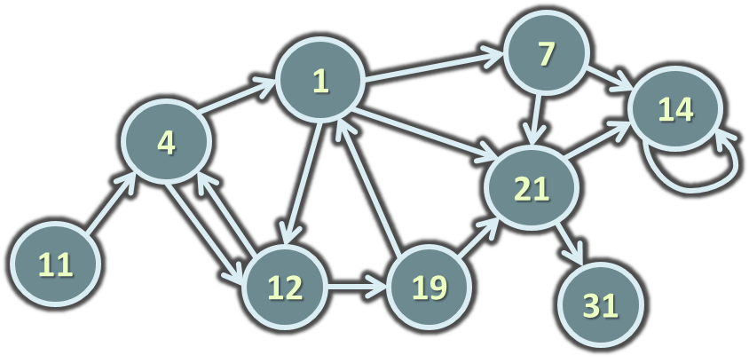
<div class="fragment balloon" style="width:210px; top:50%; left:15%">Node with multiple predecessors</div>
<div class="fragment balloon" style="width:120px; top:47%; left:60%">Node with multiple successors</div>

<!-- attr: { showInPresentation:true, hasScriptWrapper:true, style:'' } -->
# Graph Definitions
* `Node `(`vertex`)
  * Element of graph
  * Can have name or value
  * Keeps a list of adjacent nodes
* `Edge`
  * Connection between two nodes
  * Can be directed / undirected
  * Can be weighted / unweighted
  * Can have name / value

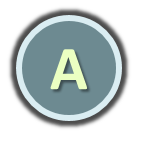
<div class="fragment balloon" style="width:60px; top:20%; right:5%">Node</div>

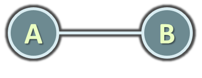
<div class="fragment balloon" style="width:60px; top:50%; right:10%">Edge</div>

<!-- attr: { showInPresentation:true, hasScriptWrapper:true, style:'' } -->
<!-- # Graph Definitions -->
<ul style="float:left; width:45%;">
  <li>`Directed graph`
    <ul>
      <li>Edges have direction</li>
    </ul>
    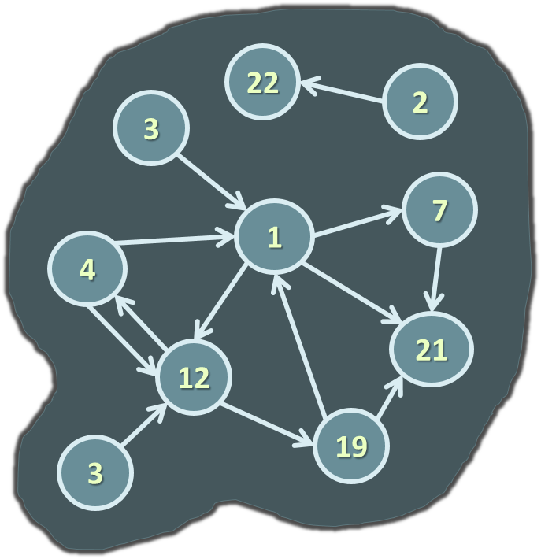
  </li>
</ul>
<ul style="float:right; width:45%;">
  <li>`Undirected graph`
    <ul>
      <li>Undirected edges</li>
    </ul>
    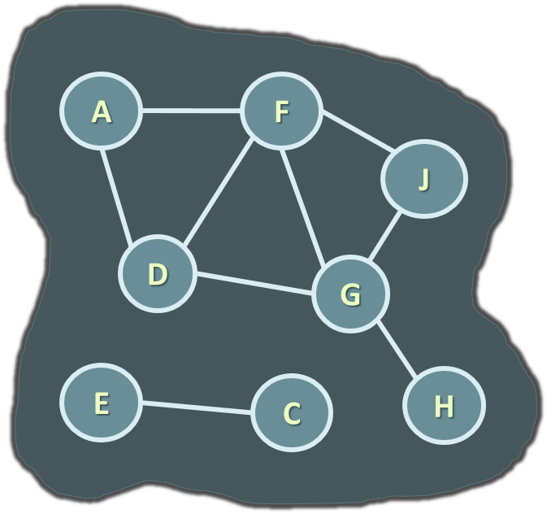
  </li>
</ul>
<div style="clear:both"></div>

<!-- attr: { showInPresentation:true, hasScriptWrapper:true, style:'' } -->
<!-- # Graph Definitions -->
* `Weighted graph`
  * Weight (cost) is associated with each edge

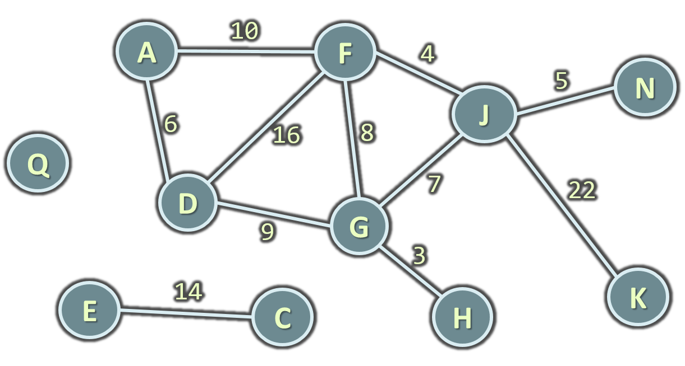

<!-- attr: { showInPresentation:true, hasScriptWrapper:true, style:'' } -->
<!-- # Graph Definitions -->
* `Path` (in undirected graph)
  * Sequence of nodes n<sub>1</sub>, n<sub>2</sub>, … n<sub>k</sub>
  * Edge exists between each pair of nodes n<sub>i</sub>, n<sub>i+1</sub>
  * Examples:
    * `A,B,C` is a path
    * `H,K,C` is not a path


<!-- attr: { showInPresentation:true, hasScriptWrapper:true, style:'' } -->
<!-- # Graph Definitions -->
* `Path` (in directed graph)
  * Sequence of nodes n<sub>1</sub>, n<sub>2</sub>, … n<sub>k</sub>
  * Directed edge exists between each pair of nodes n<sub>i</sub>, n<sub>i+1</sub>
  * Examples:
    * `A,B,C` is a path
    * `A,G,K` is not a path


<!-- attr: { showInPresentation:true, hasScriptWrapper:true, style:'' } -->
<!-- # Graph Definitions -->
* `Cycle`
  * Path that ends back at the starting node
  * _Example_:
    * `A,B,C,G,A`
* `Simple path`
  * No cycles in path
* `Acyclic graph`
  * Graph with no cycles
  * Acyclic undirected graphs are trees

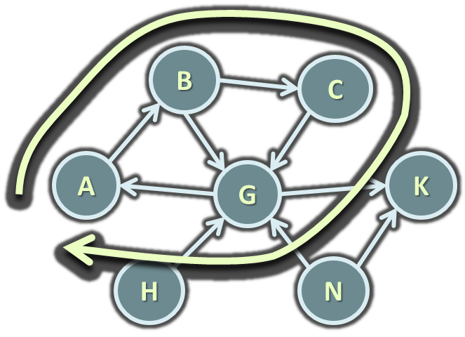


<!-- attr: { showInPresentation:true, hasScriptWrapper:true, style:'' } -->
<!-- # Graph Definitions -->
* Two nodes are `reachable` if
  * Path exists between them
* `Connected graph`
  * Every node is reachable from any other node
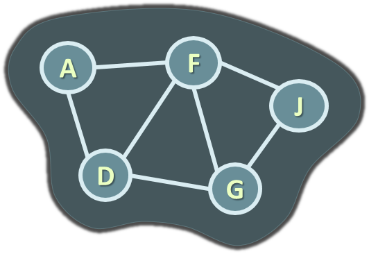
<div class="fragment balloon" style="width:190px; top:48%; left:10%" >Connected graph</div>
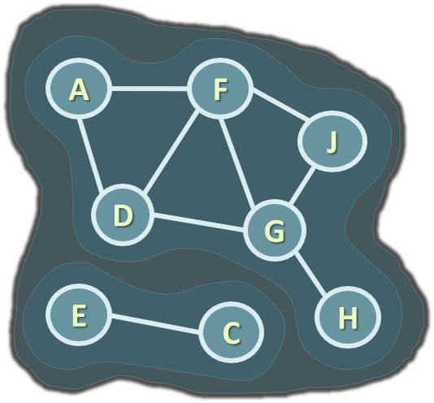
<div class="fragment balloon" style="width:220px; top:48%; right:0%" >Unconnected graph with two connected components</div>

<!-- attr: { showInPresentation:true, hasScriptWrapper:true, style:'' } -->
# Graphs and Their Applications
* Graphs have many real-world applications
  * Modeling a computer network like Internet
    * Routes are simple paths in the network
  * Modeling a city map
    * Streets are edges, crossings are vertices
  * Social networks
    * People are nodes and their connections are edges
  * State machines
    * States are nodes, transitions are edges


<!-- section start -->
<!-- attr: { class:'slide-section', showInPresentation:true, style:'' } -->
# Representing Graphs
##  Classic and OOP Ways

<!-- attr: { showInPresentation:true, hasScriptWrapper:true, style:'' } -->
# Representing Graphs
<ul style="width:45%">
  <li>`Adjacency list`<ul>
  <li>Each node holds a list of its neighbors</li>
  </ul>
  </li>
  <li>`Adjacency matrix`<ul>
  <li>Each cell keeps whether and how two nodes are connected</li>
  </ul>
  </li>
  <li>`Set of edges`</li>
</ul>

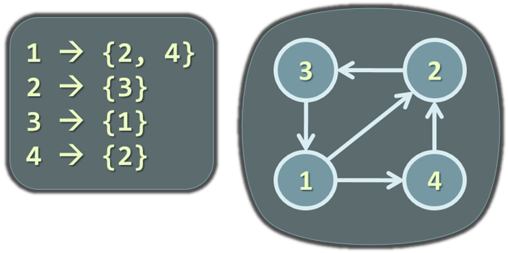
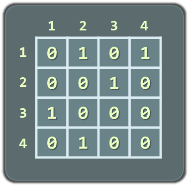
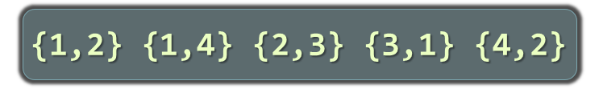

<!-- attr: { showInPresentation:true, hasScriptWrapper:true, style:'' } -->
# Simple C# Representation

```cs
public class Graph
{
  List<int>[] childNodes;
  public Graph(List<int>[] nodes)
  {
    this.childNodes = nodes;
  }
}
```

```cs
Graph g = new Graph(new List<int>[] {
  new List<int> {3, 6}, // successors of vertice 0
  new List<int> {2, 3, 4, 5, 6},// successors of vertice 1
  new List<int> {1, 4, 5}, // successors of vertice 2
  new List<int> {0, 1, 5}, // successors of vertice 3
  new List<int> {1, 2, 6}, // successors of vertice 4
  new List<int> {1, 2, 3}, // successors of vertice 5
  new List<int> {0, 1, 4}  // successors of vertice 6
});
```
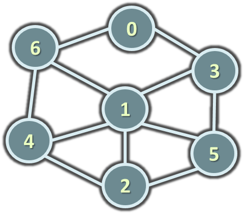

<!-- attr: { showInPresentation:true, hasScriptWrapper:true, style:'' } -->
# Advanced C# Representation
* Using OOP:
  * Class `Node`
  * Class `Connection` (`Edge`)
  * Class `Graph`
  * Optional classes
* Using external library:
  * `QuickGraph `- http://quickgraph.codeplex.com/

<!-- attr: { class:'slide-section demo', showInPresentation:true, style:'' } -->
# Representing Graphs
##  [Demo]()


<!-- section start -->
<!-- attr: { id:'questions', class:'slide-section', showInPresentation:true, style:'' } -->
# Questions
## Trees and Graphs
[link to Telerik Academy Forum](http://telerikacademy.com/Forum/Category/15/data-structures-algorithms)
