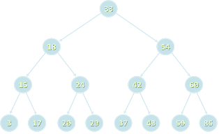

<!-- section start -->
<!-- attr: { class:'slide-title', hasScriptWrapper:true } -->
# Trees and Tree-like Data Structures
## Trees, Tree-Like Structures, Binary Search Trees, Balanced Trees, Tree Traversals, DFS and BFS
<div class="signature">
    <p class="signature-course">Trees and Tree-like Data Structures</p>
    <p class="signature-initiative">Telerik Algo Academy</p>
    <a href="http://academy.telerik.com" class="signature-link">http://academy.telerik.com</a>
</div>

<!-- section start -->
<!-- attr: { hasScriptWrapper:true } -->
# Table of Contents
- Trees Overview
  - Implementation
  - Traversal
- Search Trees
  - Balanced Binary Search Trees
    - Red-black trees
      - STL implementations
        - `set`, `multiset`
        - `map`, `multimap`
    - AVL trees
  - B-trees

<!-- attr: { hasScriptWrapper:true, showInPresentation:true } -->
<!-- # Table of Contents -->
- Heaps
  - Sample implementation
  - STL implementations
    - `priority_queue`
    - `make_heap()`, `push_heap()`, `pop_heap()`, ...
- Indexed tree
  - Compressed (Fenwick Tree)
  - Multidimensional Indexed Tree
- Tries

<!-- section start -->
<!-- attr: { class:'slide-section' } -->
# Trees
## Overview

<!-- attr: {} -->
# Trees
- Tree-like data structures are:
  - Branched recursive data structures
    - Consisting of `nodes`
    - Each node connected to other nodes
- Examples of tree-like structures
  - `Trees`: binary, balanced, ordered, etc.
  - `Graphs`: directed / undirected, weighted, etc.
  - `Networks`

<!-- attr: { class:'slide-section' } -->
# Trees and Related Terminology
## Node, Edge, Root, Children, Parent, Leaf, Binary Search Tree, Balanced Tree

<!-- attr: {} -->
# Trees
- `Tree` data structure – terminology
  - Node, edge, root, child, children, siblings, parent, ancestor, descendant, predecessor, successor, internal node, leaf, depth, height, subtree

<!-- attr: { hasScriptWrapper:true } -->
# Binary Trees
- `Binary trees`: the most widespread form
  - Each node has at most 2 children



<!-- attr: {} -->
# Binary Search Trees
- `Binary search trees` are `ordered`
  - For each node `x` in the tree
    - All the elements of the left subtree of `x` are `≤ x`
    - All the elements of the right subtree of `x` are `> x`
- Binary search trees can be `balanced`
  - `Balanced trees` have height of `~ log(x)`

<!-- attr: { class:'slide-section' } -->
# Implementing Trees
## Recursive Tree Data Structure

<!-- attr: { style:'font-size:42px', hasScriptWrapper:true } -->
# Recursive Tree Definition
- The recursive definition for `tree` data structure:
  - A single node is tree
  - Tree nodes can have zero or multiple children that are also trees
- Tree node definition in C++

```cpp
template<typename T>
class TreeNode
{
	T value;
	std::vector<TreeNode<T>> children;
	
public:
	// ...
}
```

<!-- attr: { class:'slide-section' } -->
# Tree Traversals
## DFS and BFS Traversals

<!-- attr: {} -->
# Tree Traversal Algorithms
- `Traversing a tree` means to visit each of its nodes exactly one in particular order
  - Many traversal algorithms are known
  - `Depth-First Search` (DFS)
    - Visit node's successors first
    - Usually implemented by recursion
  - `Breadth-First Search` (BFS)
    - Nearest nodes visited first
    - Implemented by a queue

<!-- attr: {} -->
# Depth-First Search (DFS)
- `Depth-First Search` first visits all descendants of given node recursively, finally visits the node itself
- DFS algorithm pseudo code

```
DFS(node)
{
	for each child c of node
		DFS(c);
	print the current node;
}
```

<!-- attr: {} -->
# Breadth-First Search (BFS)
- `Breadth-First Search` first visits the neighbor nodes, later their neighbors, etc.
- BFS algorithm pseudo code

```
BFS(node)
{
  queue &larr; node
  while queue not empty
    v &larr; queue
    print v
    for each child c of v
      queue &larr; c
}
```

<!-- attr: {} -->
# Binary Trees DFS Traversals
- DFS traversal of binary trees can be done in pre-order, in-order and post-order
  - Pre-order: root, left, right
  - In-order: left, root, right
  - Post-order: left, right, root

<!-- attr: { hasScriptWrapper:true } -->
# Iterative DFS and BFS
- What will happen if in the Breadth-First Search (BFS) algorithm a stack is used instead of queue?
  - An iterative Depth-First Search (DFS) – in-order

<pre style="position:absolute;width:45%"><code>
BFS(node)
{
  queue &larr; node
  while queue not empty
    v &larr; queue
    print v
    for each child c of v
      queue &larr; c
}
</code></pre>
<pre style="position:absolute;width:45%;left:55%"><code>
DFS(node)
{
  stack &larr; node
  while stack not empty
    v &larr; stack
    print v
    for each child c of v
      stack &larr; c
}
</code></pre>

<!-- attr: { class:'slide-section demo' } -->
# Trees and Traversals
## Live Demo

<!-- section start -->
<!-- attr: { class:'slide-section' } -->
# Balanced Search Trees
## AVL Trees, B-Trees, Red-Black Trees, AA-Trees

<!-- attr: {} -->
# Balanced Binary Search Trees
- Ordered Binary Trees (`Binary Search Trees`)
  - For each node `x` the left subtree has values `≤ x` and the right subtree has values `> x`
- Balanced Trees
  - For each node its subtrees contain nearly equal number of nodes &rarr; nearly the same height
- Balanced Binary Search Trees
  - Ordered binary search trees that have height of `log2(n)` where `n` is the number of their nodes
  - Searching costs about `log2(n)` comparisons

<!-- attr: { showInPresentation:true } -->
<!-- # Balanced Binary Search Trees -->
- Balanced binary search trees are hard to implement
  - Rebalancing the tree after insert / delete is complex
- Well known implementations of balanced binary search trees
  - `AVL trees` – ideally balanced, very complex
  - `Red-black trees` – roughly balanced, more simple
  - `AA-Trees` – relatively simple to implement
- Find / insert / delete operations need `log(n)` steps

<!-- attr: {} -->
# B-Trees
- `B-trees` are generalization of the concept of ordered binary search trees
  - B-tree of order `d` has between `d` and `2xd` keys in a node and between `d+1` and `2xd+1` child nodes
  - The keys in each node are ordered increasingly
  - All keys in a child node have values between their left and right parent keys
- If the b-tree is balanced, its search / insert / add operations take about log(n) steps
- B-trees can be efficiently stored on the disk

<!-- attr: {} -->
# Balanced Trees in STL
- `set<T>`, `multiset<T>`
  - Red-black tree based set of elements
- `map<K, V>`, `multimap<K,V>`
  - Red-black tree based map of key-value pairs

<!-- section start -->
<!-- attr: {} -->
# Heaps

<!-- section start -->
<!-- attr: {} -->
# Indexed trees

<!-- section start -->
<!-- attr: {} -->
# Tries

<!-- section start -->
<!-- attr: { id:'questions', class:'slide-section' } -->
# Questions
## Trees and Tree-like Data Structures
