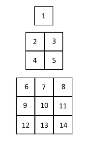

# Ильоменати

## Условие
Вапци Къцаров е велик ловец на съкровища, който е решен да плячкоса някоя от пирамидите на Ильоменатите.
Всяка пирамида е изградена от слоеве, всеки от които съдържа толкова стаи със съкровища, колкото е **втората
степен** на нивото на пирамидата, на коята се намират, преброено от върха към основата. Така първият етаж
винаги има 1 стая, вторият 4 стаи, третият 9 стаи (Слочаенос? Не мисла).
Пирамидите на Ильоменатите обаче са опасни, тъй като гъмжат от мумии, отровни скарабеи и балсамирани пингвини.
И тъй като е опасно, Вапци иска да прецени добре дали си заслужава риска от плячкосването на дадена пирамида
(т.е. дали вътре има достатъчно количество съкровища). За щастие Вапци разполага с карта на всяка от пирамидите,
които планира да плячкоса. 

## Вход
Всяка карта е във следния формат:
 - На първият ред има само едно число **N**
   - Това е височината(броят слоеве) на пирамидата
 - На всеки от останалите **N** реда има **редица числа**, разделени с интервал
   - Числата на всеки ред са точно колкото номера на реда на квадрат
   - Числата отговарят на количеството съкровища, които Вапци събира минавайки през тази стая
   - Числата могат да бъдат и отрицателни



Вапци винаги тръгва от върха на пирамидата(1) и единствено може да слиза от една стая надолу в друга.
Всеки слой на пирамидата е построен централно върху следващия. Това означава, че:
  - От върха(1) Вапци може да достигне всички стай от втория слой
  - От стая номер 2 Вапци може да слезе само в стаите с номера 6, 7, 9 и 10
  - От стая номер 3 Вапци може да слезе единствено в стаите с номера 7, 8, 10 и 11
  - И т.н...

## Изход
Напишете програма, която по карта в дадения формат изкарва на конзолата едно единствено число - максималното количество съкровища,
които Вапци може да събере от плячкосването на конкретната пирамида.

## Ограничения
- 1 < **N** <= 128
- Количеството съкровища в дадена стая винаги ще бъде в интервала **(-2<sup>21</sup>, 2<sup>21</sup>)**
- Лимит за памет: **16 MiB**
- Лимит за време: **0.2 секунди**

## Примери

### Вход
```
3
1
-2 3 4 5
25 10 -1 5 6 0 2 11 4
```

### Изход
```
24
```

### Вход
```
5
1
2 3 4 5
6 7 8 9 10 11 12 13 14
0 1 1 1 0 1 1 1 1 1 1 1 1 1 1 1
1 -20 -20 -20 -20 -20 -20 -20 -20 -20 -20 -20 -20 -20 -20 -20 -20 -20 -20 -20 -20 -20 -20 -20 -20
```

### Изход
```
10
```
