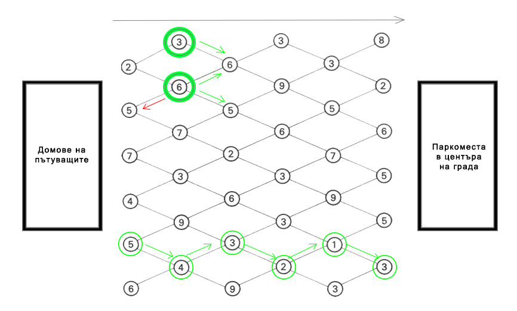
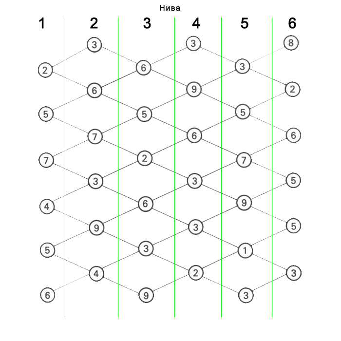

# Пътища

## Условие

Дадена е пътна карта на **улиците** и **кръстовищата** в даден град, свързваща домовете на
група хора с паркингите за коли в центъра на града. Всеки ден, група хора пътуват от
домовете си до някой паркинг, за да отидат на работа.



Фигурата по-горе изобразява **пътната карта** свързваща домовете и паркингите.
**Линиите(дъгите)** съответстват на **улиците**, а **възлите(кръговете)** - на **кръстовищата**.
Структурата на мрежата е по подобие тази на диамант. Пътищата са проектирани, така
че времето необходимо за изминаването на дадена отсечка, не зависи от пътя по който
си поел. За сметка на това, на всяко кръстовище, пътуващите трябва да **чакат**
определено време, преди да преминат. Времето, което ще прекарат в чакане, е
дефинирано с числото в центъра на всеки възел, дадено в мерна единица **минути**.
**Всеки пътник може да се движи само отляво-надясно, без да се връща назад, като е
възможно да се придвижи само до дадено съседско кръстовище, към което има
свързваща улица**.

Ако се намираме на кръстовището оградено с **плътен зелен кръг със стойност (3)**,
можем да се придвижим **само до възел (6)**, към който сочи зелената стрелка, понеже
той е единственият ни съсед. Ако се намираме на кръстовището оградено с **плътен
зелен кръг със стойност (6)**, можем да се придвижим до двата ни съседа, които се
намират отдясно със стойности (6) и (5), към които сочат зелените стрелки. **Забранено**
ни е да се движим назад, отивайки към възел (5), сочен от червената стрелка, защото
движението е ограничено **само отляво-надясно**.

Да се намери пътят, който ще отнеме **най-малко време** на пътника, за достигане от
дома му до паркинга.

В посоченият пример най-оптималният път е показан от поредица зелени стрелки
сочещи стъпките за достигане до паркинга – (5 &rarr; 4 &rarr; 3 &rarr; 2 &rarr; 1 &rarr; 3) с общо времетраене
**18 минути**.

## Вход
Входните данни ще бъдат подадени на конзолата.
На първият ред ще има **2 числа** отделени с един единствен интервал – **(S)** и **(I)**. Първото
от тези числа **(S)**, ще бъде **броят нива в пътната мрежа**, а второто **(I) – броят
кръстовища на всяко ниво**.
На следващите **(S) реда**, ще има по **(I) числа** отделени с по един интервал, всяко от тях
представляващо **времето за изчакване на дадено кръстовище** от съответното ниво.
**Забележка:** Връзките в мрежата са винаги проектирани по следния шаблон &rarr; **Първото
кръстовище от първото ниво има връзки към точно 2 съседни кръстовища от второ
ниво**. В дадения пример, кръстовище с номер **(2)** от първо ниво има връзки към **(3)** и
**(6)** от второ ниво.



## Изход
Изходните данни ще се извеждат на конзолата.
На единствения ред на стандартния изход, изкарайте **най-краткото време (в минути)**,
за което може да се стигне от домовете до паркоместата по дадената пътна мрежа.

## Ограничения
- **S** и **I** ще бъдат числа със стойности между **1** и **3000** включително.
- Числата във всеки следващ ред отговарящи на времето необходимо за преминаване през дадено кръстовище, ще бъдат със стойности между **1** и **59** включително.
- Лимит за памет: **32 MiB**
- Лимит за време: **0.6 секунди**

## Примери

### Вход
```
6 6
2 5 7 4 5 6
3 6 7 3 9 4
6 5 2 6 3 9
3 9 6 3 3 2
3 5 7 9 1 3
8 2 6 5 5 3
```

### Изход
```
18
```

### Обяснение
```
Това е примерът описан в условието на задачата.
Най-краткото време за достигане от домовете до
паркоместата, стартирайки от ниво 1 и
минавайки към следващо ниво с всяко
преминаване, е през кръстовища
5 → 4 → 3 → 2 → 1 → 3, с общо времетраене 18 минути.
```

### Вход
```
1 1
1
```

### Изход
```
1
```

### Обяснение
```
На този пример, пътната мрежа е съставена от
едно единствено ниво с едно единствено кръстовище.
Най-бързия път е през кръстовище (1) и е с
времетраене 1 минута.
```

### Вход
```
2 4
6 8 6 8
1 2 1 2
```

### Изход
```
7
```

### Обяснение
```
В този случай имаме само 1 решение:
6 → 1
```

### Вход
```
4 2
1 2
2 3
3 2
2 2
```

### Изход
```
8
```

### Обяснение
```
В този случай има повече от 1 път, който води до
правилен резултат – 8 минути. Възможни решения са:
1 → 2 → 3 → 2 (два пъти, с двете двойки от последното ниво)
1 → 3 → 2 → 2
```
