<!-- section start -->
<!-- attr: { class:'slide-title', showInPresentation:true, hasScriptWrapper:true, style:'' } -->
# Dynamic Programming
##  Brief Introduction in Problem Solving using Dynamic Programming and Memoization
<div class="signature">
   <p class="signature-course">Dynamic Programming</p>
   <p class="signature-initiative">Telerik Algo Academy</p>
   <a href="http://academy.telerik.com" class="signature-link">http://academy.telerik.com</a>
</div>


<!-- section start -->
<!-- attr: { showInPresentation:true, hasScriptWrapper:true, style:'' } -->
# Table of Contents
* Minimum and Maximum
* Divide and Conquer
* Dynamic Programming Concepts
* Fibonacci Numbers
* Subset Sum Problem
* Longest Increasing Subsequence
* Longest Common Subsequence
* Other Dynamic Programming Usages

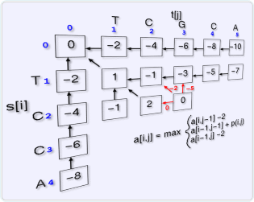

<!-- section start -->
<!-- attr: { class:'slide-section', showInPresentation:true, style:'' } -->
# Minimum and Maximum

<!-- attr: { showInPresentation:true, style:'' } -->
# Minimum and Maximum
* The `minimum` of a set of `N` elements
  * The first element in list of elements ordered in incremental order (`index = 1`)
* The `maximum` of a set of `N` elements
  * The last element in list of elements ordered in incremental order (`index = N`)
* The `median` is the "halfway point" of the set
  * When `N` is odd, index = `(N+1)/2` = unique value
  * When `N` is even, index = `&lfloor;(N+1)/2&rfloor;` (lower median) or index = `&lceil;(N+1)/2&rceil;` (upper median)

<!-- attr: { showInPresentation:true, hasScriptWrapper:true, style:'' } -->
# Finding Max Element -<br />The Stupid Way
```cpp
int findMaxStupid(vector<int>& numbers)
{
    for(int num: numbers)
    {
        bool currentNumberIsBest = true;

        for(int candidate: numbers)
            if(num < candidate)
                currentNumberIsBest = false;

        if(currentNumberIsBest)
            return num;
    }

    return numeric_limits<int>::min();
}
```
  
<!-- attr: { showInPresentation:true, style:'font-size: 36px' } -->
# Finding Min and Max Element
* Minimum element

```cpp
int minNumber(vector<int>& numbers)
{
    int min = numbers.at(0);
    for(int candidate: numbers)
        if(candidate < min)
            min = candidate;

    return min;
}
```

* Maximum element

```cpp
int maxNumber(vector<int>& numbers)
{
    int max = numbers.at(0);
    for(int candidate: numbers)
        if(candidate > max)
            max = candidate;

    return max;
}
```

<!-- section start -->
<!-- attr: { class:'slide-section', showInPresentation:true, hasScriptWrapper:true, style:'' } -->
# Divide and Conquer
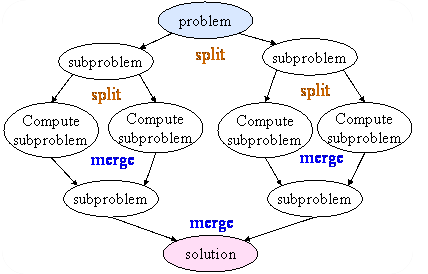

<!-- attr: { showInPresentation:true, style:'' } -->
# Divide-and-Conquer
* `Divide`: If the input size is too large to deal with in a straightforward manner
  * Divide the problem into two or more disjointed sub-problems
* `Conquer`: conquer(solve) the sub-problems when they are small enough
* `Combine`: Take the solutions to the sub-problems and "merge" these solutions into a solution for the original problem

<!-- attr: { showInPresentation:true, hasScriptWrapper:true, style:'' } -->
# Divide-and-Conquer Example
* MergeSort
  * The sub-problems are independent, all different

```cpp
void mergeSort(int* arr, int left, int right) {
    if (right > left) {
        int mid = (right + left) / 2;
        mergeSort(arr, left, mid);
        mergeSort(arr, (mid+1), right);
        merge(arr, left, (mid+1), right);
    }
}
```
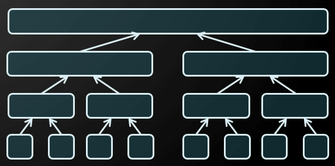

<!-- attr: { showInPresentation:true, hasScriptWrapper:true, style:'' } -->
# Divide-and-Conquer Algorithms
* Binary search
  * [Closest pair in 2D geometry](https://en.wikipedia.org/wiki/Closest_pair_of_points_problem)
* Quick sort
* Merging arrays
  * Merge sort
* Finding majorant
* [Tower of Hanoi](http://interactivepython.org/runestone/static/pythonds/Recursion/TowerofHanoi.html)
* Fast multiplication
  * Strassen’s Matrix Multiplication

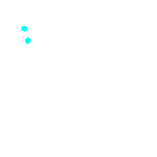
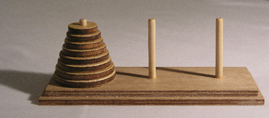

<!-- section start -->
<!-- attr: { class:'slide-section', showInPresentation:true, style:'' } -->
# Dynamic Programming Concepts

<!-- attr: { showInPresentation:true, style:'font-size: 0.9em' } -->
# Dynamic Programming
* How dynamic programming (DP) works?
  * Approach to solving complex problems
  * Solve the problem by solving smaller problems
    * Avoid solving smaller problems twice by storing partial solutions
  * Usually they are solved bottom-up
* Steps to designing a DP algorithm:
  * Characterize `optimal substructure`
  * `Recursively` define the value of an optimal solution
  * Compute the value `bottom up`
  * (if needed) `Construct` an optimal solution

<!-- attr: { showInPresentation:true, style:'' } -->
# Elements of DP
* DP has the following characteristics
  * Simple sub-problems
    * We break the original problem to smaller sub-problems that have the same structure
  * Optimal substructure of the problems 
    * The optimal solution to the problem contains within optimal solutions to its sub-problems
  * Overlapping sub-problems 
    * There exist some places where we solve the same sub-problem more than once

<!-- attr: { showInPresentation:true, style:'' } -->
# Difference between DP and Divide-and-Conquer
* Using Divide-and-Conquer to solve problems (that can be solved using DP) is `inefficient`
  * Because the same common sub-problems have to be solved many times
* DP will solve each of them once and their answers are stored in a `table` for future use
  * Technique known as `memoization`

<!-- section start -->
<!-- attr: { class:'slide-section', showInPresentation:true, hasScriptWrapper:true, style:'' } -->
# Fibonacci Numbers
##  From "divide and conquer" to dynamic programming

<!-- attr: { showInPresentation:true, hasScriptWrapper:true, style:'' } -->
# Fibonacci sequence
* The Fibonacci numbers are the numbers in the following integer sequence:
  * `0`, `1`, `1`, `2`, `3`, `5`, `8`, `13`, `21`, `34`, `55`, `89`, `144`, …
  * The first two numbers are `0` and `1`
  * Each subsequent number is the sum of the previous two numbers
* In mathematical terms:
  * `F`<sub>`n`</sub> = `F`<sub>`n-1`</sub> + `F`<sub>`n-2`</sub>
  * `F`<sub>`0`</sub> = `0`
  * `F`<sub>`1`</sub> = `1`

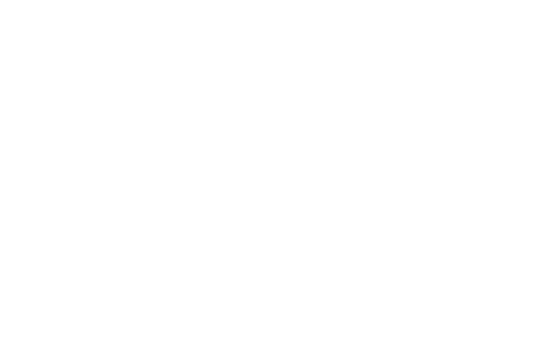

<!-- attr: { showInPresentation:true, hasScriptWrapper:true, style:'font-size:0.9em' } -->
# Divide and Conquer Approach
* How can we find the `n`<sup>`th`</sup> Fibonacci number using recursion ("divide and conquer")
* Directly applying the recurrence formula:

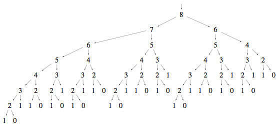

```cpp
long fibonacci(int n)
{
    if (n == 0) return 0;
    if (n == 1) return 1;
    return fibonacci(n - 1) + fibonacci(n - 2);
}
```

<!-- attr: { showInPresentation:true, style:'' } -->
# Fibonacci and Memoization
* We can save the results from each function call
* Every time when we call the function we check if the value is already calculated
* This saves a lot of useless calculations!
* http://en.wikipedia.org/wiki/Memoization

```cpp
long fibonacci(int n)
{
    if (memo[n] != 0) return memo[n];
    if (n == 0) return 0;
    if (n == 1) return 1;
    memo[n] = fibonacci(n - 1) + fibonacci(n - 2);
    return memo[n];
}
```

<!-- attr: { showInPresentation:true, hasScriptWrapper:true, style:'font-size:0.9em' } -->
# Fibonacci and DP
* How to find the `n`<sup>`th`</sup> Fibonacci number using the dynamic programming approach?
  * We can start solving the Fibonacci problem from bottom-up calculating partial solutions
  * We know the answer for the `0`<sup>`th`</sup> and the `1`<sup>`st`</sup> number of the Fibonacci sequence
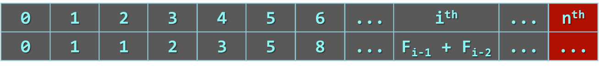
  * And we know the `formula`  to calculate each of the next numbers (`F`<sub>`i`</sub>` = F`<sub>`i-1`</sub>` + F`<sub>`i-2`</sub>)

<!-- attr: { showInPresentation:true, hasScriptWrapper:true, style:'' } -->
# Compare Fibonacci Solutions
* Recurrent solution
  * Complexity: ~`O(φ`<sup>`n`</sup>`)` = `O(1.618`<sup>`n`</sup>`)`
* DP or memoization solution
  * Complexity: ~`O(n)`
* Dynamic programming solutions is way faster than the recurrent solution
  * If we want to find the `36`<sup>`th`</sup> Fibonacci number:
    * Dynamic programming solution takes ~`36` steps
    * Recurrent solution takes ~`48 315 633` steps

<!-- section start -->
<!-- attr: { class:'slide-section', showInPresentation:true, hasScriptWrapper:true, style:'' } -->
# Subset Sum Problem

<!-- attr: { showInPresentation:true, hasScriptWrapper:true, style:'' } -->
# Subset Sum Problems
* Given a set of integers, is there a non-empty subset whose sum is zero?
* Given a set of integers and an integer `S`, does any non-empty subset sum to `S`?
* Given a set of integers, find all possible sums<!-- .element: style="width:60%" -->
* Can you equally separate the value of coins? <!-- .element: style="width:60%" -->

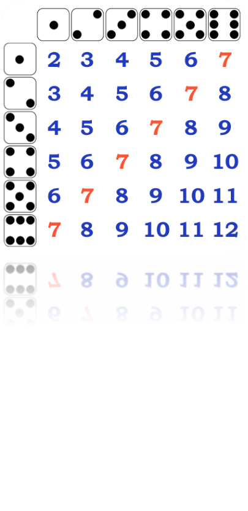

<!-- attr: { showInPresentation:true, style:'font-size:0.95em' } -->
# Subset Sum Problem Algorithm
* Solving the subset sum problem:
  * numbers = `{3,5,-1,4,2}`, sum = `6`
  * start with possible = `{0}`
* Step 1: obtain all possible sums of `{3}`
  * possible = `{0}` ∪ `{0+3}` = `{0,3}`
* Step 2: obtain all possible sums of `{3,5}`
  * possible = `{0,3}` ∪ `{0+5,3+5}` = `{0,3,5,8}` 
* Step 3: obtain all possible sums of `{3,5,-1}`
  * possible = `{0,3,5,8}` ∪ `{0-1,3-1,5-1,8-1}` = `{-1,0,2,3,4,5,7,8}`
* …

<!-- attr: { showInPresentation:true, style:'font-size:0.9em' } -->
# Subset Sum Problem - Recursive

```cpp
bool isSubsetSumRecursive(int* set, int n, int sum)
{
   // Base Cases
   if (sum == 0)
      return true;
   if (n == 0 && sum != 0)
      return false;

   // If last element is greater than sum, then ignore it
   if (set[n - 1] > sum)
   {
       return isSubsetSumRecursive(set, n - 1, sum);
   }
   /* check if sum can be obtained by any of the following
      (a) including the last element
      (b) excluding the last element   */
   return isSubsetSumRecursive(set, n - 1, sum)
       || isSubsetSumRecursive(set, n - 1, sum - set[n - 1]);
}
```
<!-- attr: { showInPresentation:true, hasScriptWrapper:true, style:'font-size: 38px' } -->
# Subset Sum Problem - DP

```cpp
bool isSubsetSum(vector<int>& set, int sum)
{
    int sumOfAll = 0;
    for(int num: set) sumOfAll += num;
    int* last = new int[sumOfAll + 1];
    int currentSum = 0;
    for (int i = 1; i < sumOfAll; i++) last[i] = -1;
    for (int i = 0; i < set.size(); i++)
    {
        for (int j = currentSum; j + 1 > 0; j--)
        {
            if (last[j] != -1 &&
                last[j + set.at(i)] == -1)
            {
                last[j + set.at(i)] = i;
            }
        }
        currentSum += set.at(i);
    }

    bool result = last[sum] != -1;
    delete[] last;
    return result;
}
```

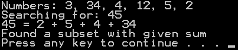


<!-- section start -->
<!-- attr: { class:'sl ide-section', showInPresentation:true, hasScriptWrapper:true, style:'' } -->
# Longest Increasing Subsequence
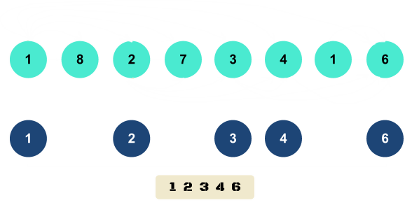

<!-- attr: { showInPresentation:true, style:'font-size:0.9em' } -->
# Longest Increasing Subsequence
* Find a subsequence of a given sequence in which the subsequence elements are in increasing order, and in which the subsequence is as long as possible
    * This subsequence is not necessarily continuous nor unique
* The longest increasing subsequence problem is solvable in time `O(n*log(n))` [[more info](http://stackoverflow.com/a/7614385/1862812)]
* We will review one simple DP algorithm with complexity `O(n*n)`
* Example: `1`, 8, `2`, 7, `3`, `4`, 1, ` 6`

<!-- attr: { showInPresentation:true, hasScriptWrapper:true, style:'' } -->
# LIS – Dynamic Programming

```cpp
L[0] = 1; P[0] = NoPrevious;
for (int i = 1; i < numbersCount; i++)
{
    L[i] = 1;
    P[i] = NoPrevious;
    for (int j = i - 1; j >= 0; j--)
    {
        if (L[j] + 1 > L[i] && S[j] < S[i])
        {
            L[i] = L[j] + 1;
            P[i] = j;
        }
    }
    if (L[i] > maxLength)
    {
        bestIndex = i;
        maxLength = L[i];
    }
}
```

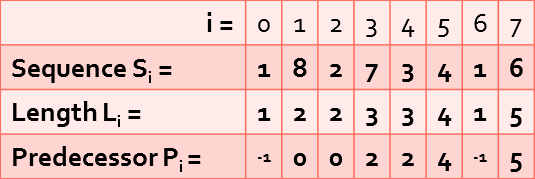

<!-- attr: { showInPresentation:true, hasScriptWrapper:true, style:'' } -->
# LIS – Restore the Sequence

```cpp
void printLongestIncreasingSubsequence(
    int* sequence, int* predecessor, int maxIndex)
{
    auto lis = new vector<int>();
    while (maxIndex != -1)
    {
        lis->push_back(sequence[maxIndex]);
        maxIndex = predecessor[maxIndex];
    }
    cout << "subsequence = ";
    for(int n: *lis)
        cout << n << ", ";
}
```


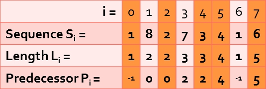


<!-- section start -->
<!-- attr: { class:'slide-section', showInPresentation:true, style:'' } -->
# Longest Common Subsequence 
##  Recursive and DP Approach

<!-- attr: { showInPresentation:true, hasScriptWrapper:true, style:'' } -->
# Longest Common Subsequence
* Given two sequences `x[1..m]` and `y[1..n]`, find their longest common subsequence (LCS)
* For example if we have `x="ABCBDAB"` and `y="BDCABA"` their longest common subsequence will be `"BCBA"`

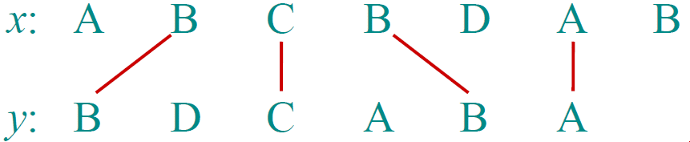

<!-- attr: { showInPresentation:true, hasScriptWrapper:true, style:'' } -->
# LCS – Recursive Approach
* `S`<sub>`1`</sub> = `GCCCTAGCG`, `S`<sub>`2`</sub> = `GCGCAATG`
  * Let `C`<sub>`1`</sub> = the right-most character of `S`<sub>`1`</sub>
  * Let `C`<sub>`2`</sub> = the right-most character of `S`<sub>`2`</sub>
  * Let `S`<sub>`1`</sub>`'` = `S`<sub>`1`</sub> with `C`<sub>`1`</sub> "chopped-off"
  * Let `S`<sub>`2`</sub>`'` = `S`<sub>`2`</sub> with `C`<sub>`2`</sub> "chopped-off"
* There are three recursive subproblems:
  * `L`<sub>`1`</sub> = `LCS(S`<sub>`1`</sub>`',S`<sub>`2`</sub>`)`
  * `L`<sub>`2`</sub> = `LCS(S`<sub>`1`</sub>`,S`<sub>`2`</sub>`')`
  * `L`<sub>`3`</sub> = `LCS(S`<sub>`1`</sub>`',S`<sub>`2`</sub>`')`

<!-- attr: { showInPresentation:true, hasScriptWrapper:true, style:'' } -->
<!-- # LCS – Recursive Approach -->
* The solution to the original problem is whichever of these is the longest:
  * `L`<sub>`1`</sub>
  * `L`<sub>`2`</sub>
  * If `C`<sub>`1`</sub> is not equal to `C`<sub>`2`</sub>, then `L`<sub>`3`</sub>
  * If `C`<sub>`1`</sub> equals `C`<sub>`2`</sub>, then `L`<sub>`3`</sub> appended with `C`<sub>`1`</sub>
* This recursive solution requires multiple computations of the same sub-problems
* This recursive solution can be replaced with DP

<!-- attr: { showInPresentation:true, hasScriptWrapper:true, style:'' } -->
# Initial LCS table
* To compute the LCS efficiently using dynamic programming we start by constructing a table in which we build up partial results

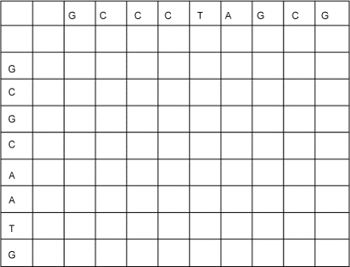

<!-- attr: { showInPresentation:true, hasScriptWrapper:true, style:'' } -->
<!-- # Initial LCS table -->
* We'll fill up the table from top to bottom, and from left to right
* Each cell = the length of an LCS of the two string prefixes up to that row and column
* Each cell will contain a solution to a sub-problem of theoriginal problem <!-- .element: style="width:60%" -->
  * `S`<sub>`1`</sub> = `GCCCTAGCG`
  * `S`<sub>`2`</sub> = `GCGCAATG`

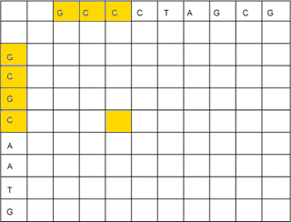

<!-- attr: { showInPresentation:true, hasScriptWrapper:true, style:'' } -->
# LCS table – base cases filled in
* Each empty string has nothing in common with any other string, therefor the 0-length strings will have values `0` in the LCS table

```cpp
for (i = 0; i <= n; i++)
{
    c[i][0] = 0;
}
```

```cpp
for (i = 0; i <= m; i++)
{
    c[0][i] = 0;
}
```

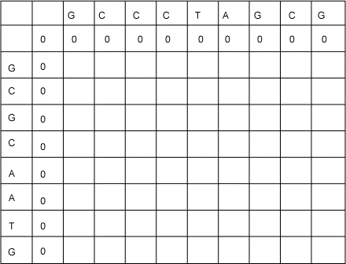

<!-- attr: { showInPresentation:true, hasScriptWrapper:true, style:'' } -->
# LCS – Dynamic Programming

```cpp
int** LCS(char* first, char* second, int n, int m)
{
  auto c = new int*[m + 1];
  c[0] = new int[n + 1];
  for (int i = 1; i <= m; i++)
  {
    c[i] = new int[n + 1];
    for (int j = 1; j <= n; j++)
    {
       if (first[i - 1] == second[j - 1])
          c[i][j] = c[i - 1][j - 1] + 1;
       else
          c[i][j] = max(c[i][j - 1], c[i - 1][j]);
    }
  }
  return c; // Answer in c[m, n]
}
```

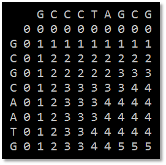

<!-- attr: { showInPresentation:true, hasScriptWrapper:true, style:'' } -->
# LCS – Reconstruct the Answer

```cpp
void printLCS(int i, int j, int** c)
{
    if (i == 0 || j == 0) return;
    if (first[i - 1] == second[j - 1])
    {
        printLCS(i - 1, j - 1, c);
        cout << second[j - 1];
    }
    else if (c[i][j] == c[i - 1][j])
    {
        printLCS(i - 1, j, c);
    }
    else
    {
        printLCS(i, j - 1, c);
    }
}
```

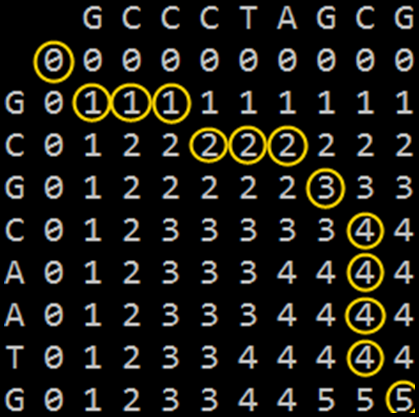

<!-- section start -->
<!-- attr: { class:'slide-section', showInPresentation:true, style:'' } -->
# Other DP Usages

<!-- attr: { showInPresentation:true, hasScriptWrapper:true, style:'' } -->
# Demo: Moving Problem
* In many DP problems there is a moving object with some restrictions
* For example: In how many ways you can reach from top-left corner of a grid to the bottom-right?
    * You can move only right and down
    * Some cells are unreachable

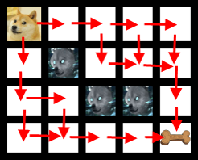


<!-- attr: { showInPresentation:true, hasScriptWrapper:true, style:'font-size:0.8em' } -->
# DP Applications
* Matematical, finance and economic optimizations
    * Optimal consumption and saving
    * The core idea of DP is to avoid repeated work by remembering partial results. This is a very common technique whenever performance problems arise
* Bioinformatics
    * sequence alignment, protein folding, RNA structure prediction and protein-DNA binding
* Control theory, information theory
* Operations research, decision making
* Computer science: 
    * Theory, Graphics, AI
    * Markov chains
    * Spelling correction

<!-- attr: { showInPresentation:true, style:'font-size:0.85em' } -->
# Some Famous DP Algorithms
* Integer Knapsack Problem
* Unix diff for comparing two files
* Dijkstra's algorithm for the shortest path problem
* Bellman–Ford algorithm shortest distance in a graph
* Floyd's All-Pairs shortest path algorithm
* Cocke-Kasami-Younger for parsing context free grammars
* Methods for solving the travelling salesman problem
* Some methods for solving interval scheduling problems
* Edit distance (Levenshtein distance)
* Many other string and graph algorithms
* [en.wikipedia.org/wiki/Dynamic_programming](http://en.wikipedia.org/wiki/Dynamic_programming)

<!-- attr: { hasScriptWrapper:true, showInPresentation:true, style:'font-size:0.85em' } -->
# Demo: 2D Knapsack Problem
 * [Famous DP problem](https://en.wikipedia.org/wiki/Knapsack_problem)
   * Given a maximum weight you can carry and a set of items with values and weights, how much value can you carry without violating the weight constraint?
 * Solutions:
   * Recursive - intuitive, but slow - O(2<sup>N</sup>) without memoization
   * DP solution - uses a lookup table, runs in O(N &#42; W) time, where **N** is the number of items and **W** is the capacity of the knapsack 
   


<!-- section start -->
<!-- attr: { showInPresentation:true, style:'font-size:0.95em' } -->
# Summary
* **Divide-and-conquer** method for algorithm design
* **DP** is a way of `improving` on inefficient divide-and-conquer algorithms
* **DP** is applicable when the sub-problems are dependent, that is, `when sub-problems share sub-sub-problems`
* **Recurrent functions** can be solved `efficiently`
* **Longest increasing** and **Longest common** subsequence problems `can be solved efficiently` using **DP** approach


<!-- section start -->
<!-- attr: { id:'questions', class:'slide-section', showInPresentation:true, style:'' } -->
# Questions
## Dynamic Programming
[link to Telerik Academy Forum](http://telerikacademy.com/Forum/Category/15/data-structures-algorithms)
