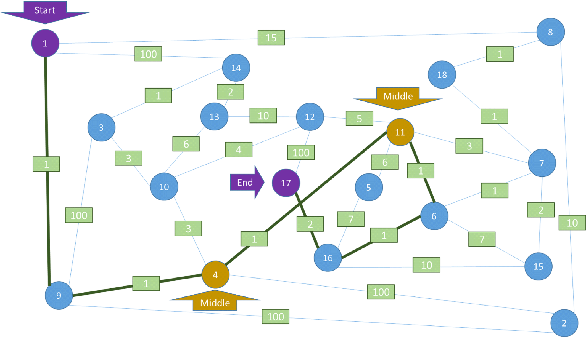

# Приятели

## Условие
Пешо и Гошо са програмисти. Гошо е некадърен програмист. Той винаги успява да открадне решението на някоя задача от някого и да я предаде на учителката си първи. Пешо, от друга страна, е много добро момче. Той не е особено умен, но пък е мил.

Двамата има да решат следната задача: Имайки множество градове, намерете най-краткия път между два града, като задължително трябва да минете през други два. Разстоянието между всеки два града е цяло положително число между 1 и 1000.

## Пример:



##

В пътя от началния град до някой от междинните не може да участва другият междинен или крайният град. В пътя от крайния град до някой от междинните не може да участва другият междинен или началният град.

## Вход
- Входът ще се чете от конзолата
- На първия ред от входа ще намерите числата `N` и `M`, разделени с един интервал (space)
  - N е броя градове
  - M е броя на връзките между два града
- На втория ред от входа ще намерите **началния** и **крайния върхове** на пътя, разделени с един интервал (space)
- На третия ред от входа ще намерите **двата междинни града**, през които трябва да **минава пътя от началния и крайния градове**
- На следващите M реда ще намерите **връзките между градовете**:
  -	По три числа на ред: `F T D`
    - `F T D` означава, че има има връзки от **F до T** и от **T до F**, като **разстоянието на тези връзки е D**

## Изход
- Изходът ще се извежда на конзолата.
- Изходът се състои от един единствен ред: **минималното разстояние от началния до крайния върхове, като се мине през междинните такива**

## Ограничения
-	`N` ще бъдe между `1` и `1000` включително
-	`M` ще бъде между `1` и `2000`
-	`D` ще бъде между `1` и `1000`
-	Позволено време за вашата програма: **0.1 секунда**
-	Позволена памет за вашата програма: **16 MB**

##  Примери

### Вход

```
18 30
1 17
11 4
1 8 15
1 9 1
1 14 100
2 4 100
2 8 10
2 9 100
3 9 100
3 10 3
3 14 1
4 9 1
4 10 3
4 11 1
5 11 6
5 16 7
6 7 1
6 11 1
6 15 7
6 16 1
7 11 3
7 15 2
7 18 1
8 18 1
10 12 4
10 13 6
11 12 5
12 13 10
12 17 100
13 14 2
15 16 10
16 17 2
```

### Изход

```
7
```
